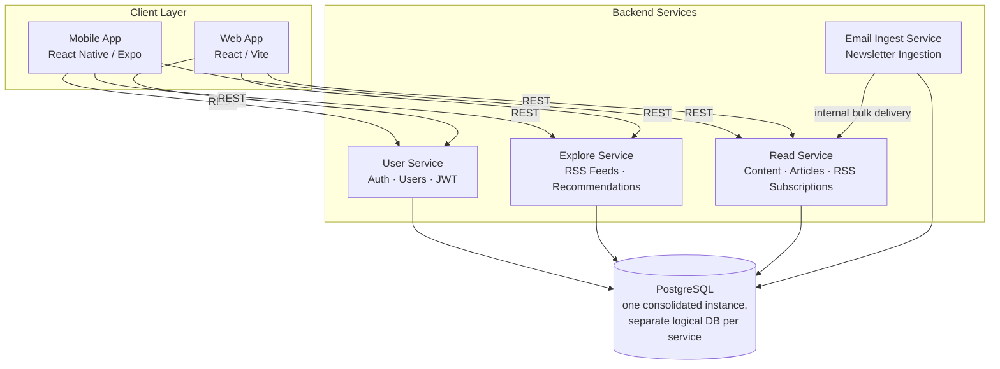
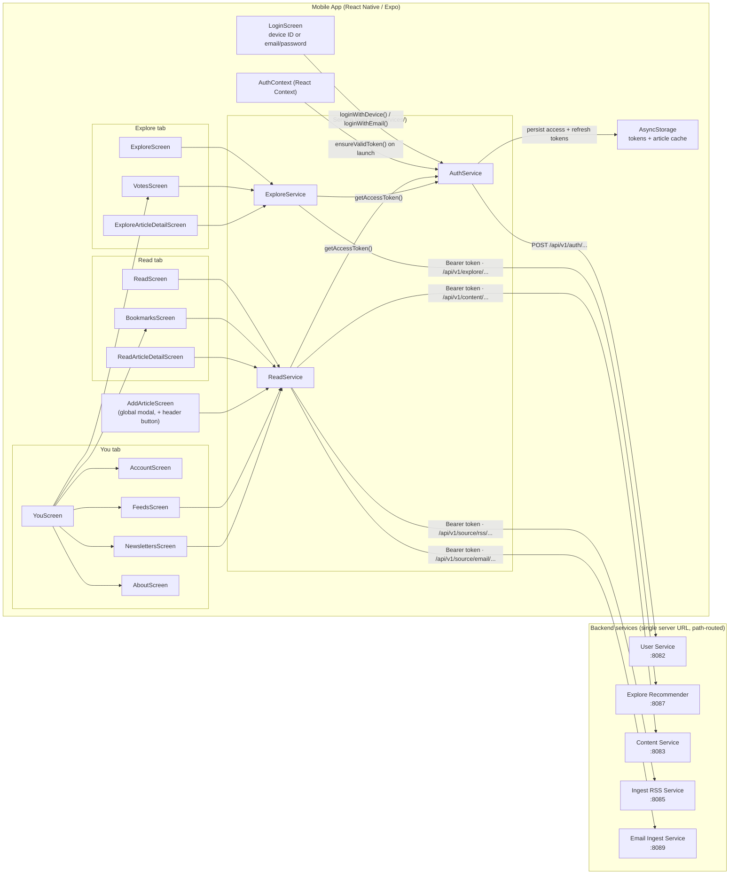
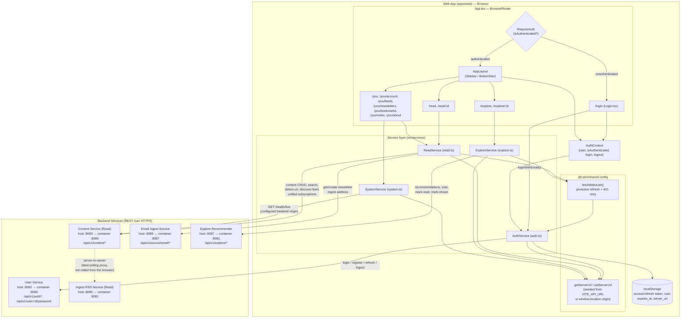
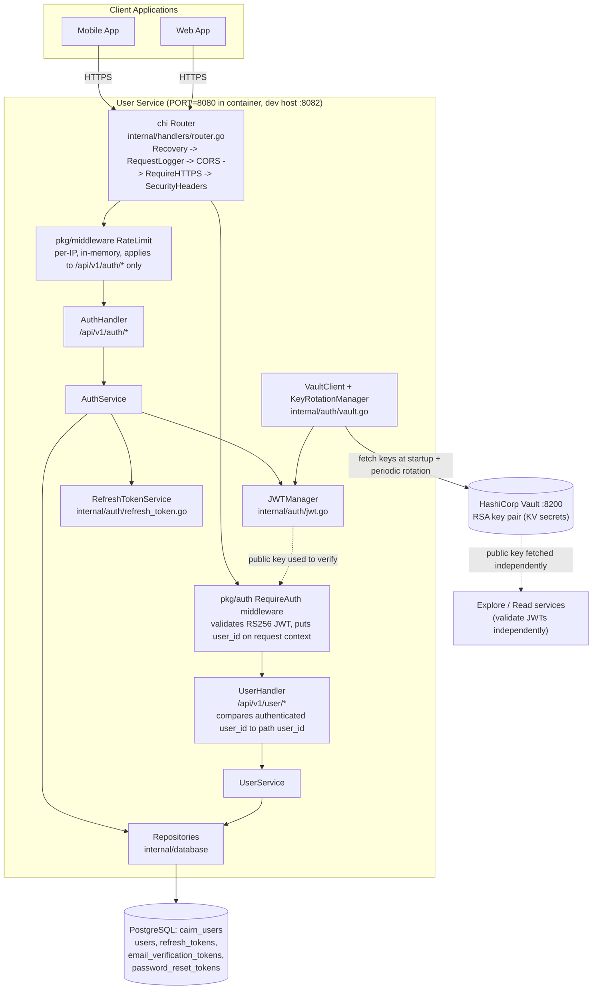
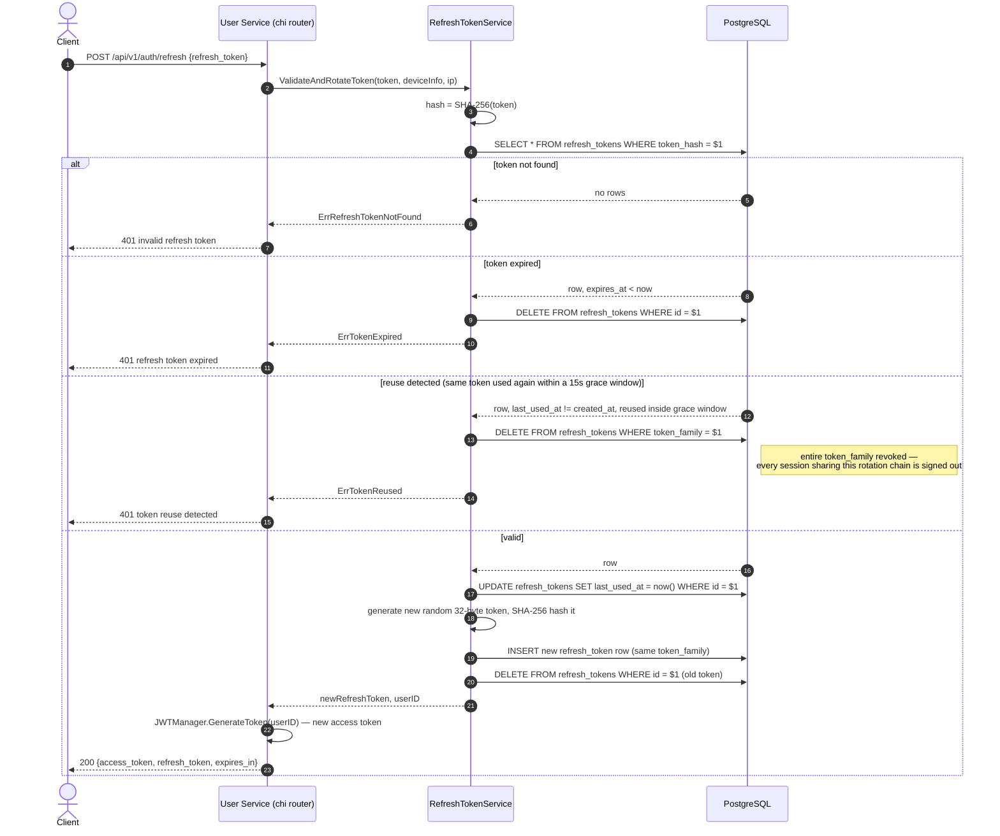
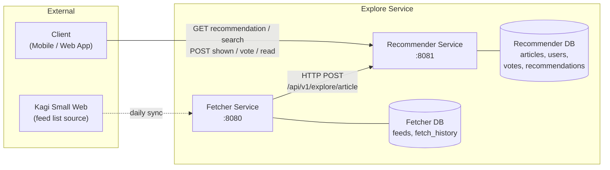
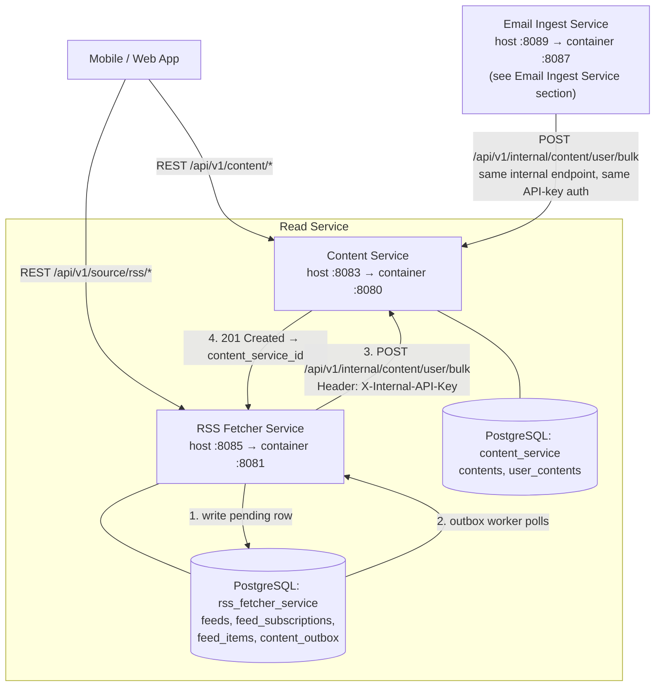
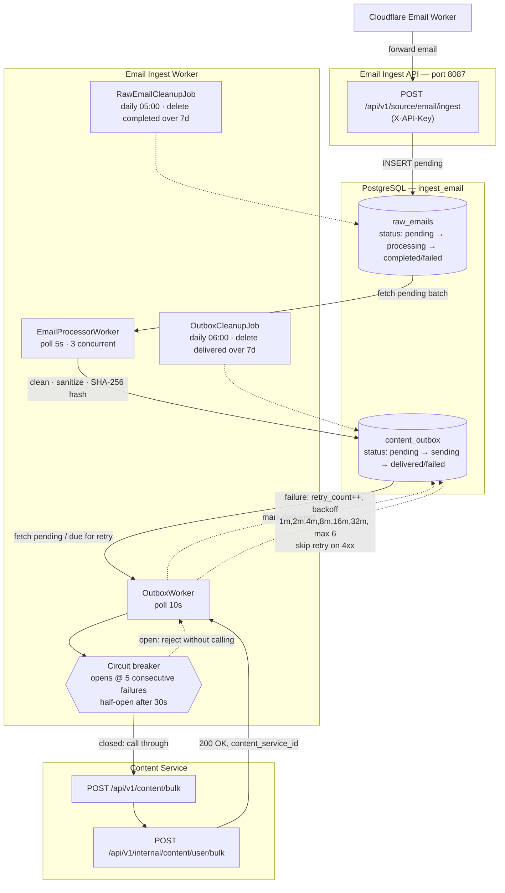

# Cairn Architecture

This document provides a detailed overview of Cairn's architecture, design decisions, data flows, and technical implementation across the mobile app, web app, and all backend services.

## Table of Contents

- [System Overview](#system-overview)
- [Mobile App](#mobile-app)
- [Web App](#web-app)
- [User Service](#user-service)
- [Explore Service](#explore-service)
- [Read Service](#read-service)
- [Email Ingest Service](#email-ingest-service)
- [Security Considerations](#security-considerations)
- [Performance Considerations](#performance-considerations)
- [Monitoring & Observability](#monitoring--observability)

## System Overview

Cairn is a microservices-based read-it-later application backend designed for scalability, reliability, and maintainability. The system consists of multiple independent services that communicate via REST APIs.

### High-Level Architecture



### Port Reference

Ports differ between what a service listens on inside its container and where the dev Docker Compose (`infrastructure/docker/dev/docker-compose.yml`) exposes it on the host. Service-to-service calls inside the Docker network always use container ports; a developer hitting a service from their own machine uses the dev host port.

| Service | Container Port | Dev Host Port |
|---|---|---|
| User Service | 8080 | 8082 |
| Explore Fetcher | 8080 | 8088 |
| Explore Recommender | 8081 | 8087 |
| Read: Content Service | 8080 | 8083 |
| Read: Content Worker (health only) | 8084 | 8084 |
| Read: RSS Fetcher Service | 8081 | 8085 |
| Read: RSS Fetcher Worker (health only) | 8086 | 8086 |
| Email Ingest Service | 8087 | 8089 |
| Email Ingest Worker (health only) | 8090 | 8090 |
| HashiCorp Vault | 8200 | 8200 |
| PostgreSQL | 5432 | 5432 |

The selfhost single-container build (`infrastructure/docker/selfhost/`) runs every service behind one process and exposes it on a single port, `8099`.

### Design Principles

1. **Service Isolation**: Each service owns its data; no direct database access across services
2. **REST-Only Communication**: Services communicate exclusively via HTTP REST APIs
3. **Eventual Consistency**: Acceptable for content delivery; outbox pattern ensures reliability
4. **Idempotency**: Operations designed to be safely retried
5. **Fail-Safe Defaults**: Graceful degradation when dependencies are unavailable
6. **Single Responsibility**: Each service has a clear, focused purpose

---

## Mobile App

The Mobile App is a React Native (Expo) client for iOS, Android, and web that lets users discover, save, and read articles from RSS feeds, newsletters, and manually added links. It contains no business logic of its own — auth, storage, and recommendations all live in the backend services — and acts as a thin REST client with local persistence for tokens and an offline-friendly article cache.

### Service Purpose and Responsibilities

**Core Responsibilities**:
- Tab-based navigation across Read (saved articles), Explore (recommendations), and You (profile/settings), plus modal/stack screens for article detail, adding links, and search
- Device-ID and email/password authentication, with proactive access-token refresh before each API call
- A service layer (`AuthService`, `ReadService`, `ExploreService`) that attaches `Authorization: Bearer` headers and retries on 401/5xx
- Local persistence via AsyncStorage: auth tokens, the chosen backend server URL, and stale-while-revalidate caches for the Read and Explore lists
- Runtime backend switching (a server URL field on the login screen) for pointing the app at a self-hosted or local backend without a rebuild

**Technology Stack**:
- React Native 0.81 + Expo SDK 54 (iOS, Android, Web)
- TypeScript, React Navigation (stack + bottom tabs)
- React Context (`AuthContext`) for auth state
- `@cairn/shared` workspace package for the API config layer and data types (shared with the web app)
- AsyncStorage for local persistence
- `react-native-render-html` for rendering saved article content

### App Architecture



The app talks to a single backend server URL (defaulting to `https://cairn.seatrain.net`, overridable per-device) rather than per-service hosts; the ports above are the underlying services that URL's `/api/v1/...` paths route to in the dev `docker-compose` environment. The Explore Fetcher service (dev port `:8088`) is internal-only and never called directly by the app.

---

## Web App

The Web App is a React (Vite) browser client offering the same core reading experience as the mobile app — saved articles, RSS/newsletter discovery, and recommendations — served as a single-page application, typically same-origin with the backend it talks to.

### Service Purpose and Responsibilities

**Core Responsibilities**:
- Route-based navigation across Read, Explore, and You (account/feeds/newsletters/bookmarks/votes/about), guarded by a `RequireAuth` route wrapper
- Email/password authentication only — browsers have no Expo device identifier, so device-ID login (mobile-only) isn't offered
- A service layer (`AuthService`, `ReadService`, `ExploreService`, `SystemService`) ported from the mobile app's equivalents and adapted to browser storage
- Session persistence via `localStorage`, with proactive token refresh and a single 401-retry choke point (`fetchWithAuth`)
- Same-origin backend resolution by default (`window.location.origin`), overridable via `VITE_API_URL` in development — this is what lets the selfhost single-container build (port `8099`) serve the SPA and all APIs behind one origin

**Technology Stack**:
- React + Vite, TypeScript
- React Router (`BrowserRouter`)
- React Context (`AuthContext`) for auth state
- `@cairn/shared` workspace package for the API config layer and data types (shared with the mobile app)
- `localStorage` for token and session persistence

### App Architecture



### Authentication and Session Handling

- `AuthService` is a near-verbatim port of the mobile auth service, with two deliberate differences: it persists tokens to `localStorage` (synchronous) instead of `AsyncStorage`, and it drops device-ID/anonymous login — web users authenticate with email/password only.
- Tokens (`access_token`, `refresh_token`, `expires_at`, `user`) are cached both in static class fields and `localStorage`, so any tab reload rehydrates the session via `AuthService.initialize()`.
- `AuthService.fetchWithAuth()` is the single choke point every authenticated service call goes through: it proactively refreshes a token expiring within 5 minutes, and reactively retries once on an HTTP 401 before giving up and clearing the session.
- `AuthContext` wraps the router, exposes `{ user, isAuthenticated, isLoading, login, logout }`, and subscribes to `AuthService.onAuthStateChange` so a token wipe triggered deep inside a service call (e.g. a failed refresh) is reflected in the UI and redirects to `/login` via the `RequireAuth` route guard.
- Unlike the mobile app, the web app does not expose a runtime UI to change the backend URL — only mobile has that.

### API Client Layer

- `ReadService`, `ExploreService`, and `SystemService` are thin, per-domain wrappers around `fetch`/`AuthService.fetchWithAuth`, each ported from the equivalent mobile service and adapted to `@cairn/shared`'s `getServerUrl()`.
- `ReadService` talks to the Content Service for everything under `/api/v1/content/*` — the reading list, search, saving/removing articles, URL/feed detection, and the unified subscriptions list — and to the Email Ingest Service for the user's newsletter ingest address. The Content Service, not the browser, is what talks to the Ingest RSS Service server-to-server.
- `ExploreService` talks only to the Explore Recommender for recommendations, voting, and read/shown tracking.
- All response envelopes (`{ data, pagination? }` / `{ message | error }`) are parsed consistently, and backend DTOs are mapped into the shared `Article` UI shape before components ever see them.

---

## User Service

The User Service is responsible for managing user access to the Cairn platform, including user registration, authentication, and account management. It provides stateless JWT-based authentication with secure key management through HashiCorp Vault.

### Service Purpose and Responsibilities

**Core Responsibilities**:
- User account creation and management (email/password or mobile device ID)
- Stateless JWT authentication with RS256 signing
- Refresh token management with automatic rotation and reuse detection
- Mobile device authentication via Expo device ID
- Account upgrade from device-only to email/password
- Authorization checks ensuring users can only access their own data
- Secure secrets management with HashiCorp Vault

**Technology Stack**:
- Go 1.24+
- Chi HTTP router (`go-chi/chi/v5`)
- PostgreSQL (`cairn_users` logical database) for user data, refresh tokens, and verification/reset tokens
- HashiCorp Vault for JWT key management
- JWT with RS256 (2048-bit RSA keys), `golang-jwt/jwt/v5`
- Bcrypt for password hashing (cost factor 12 by default; valid range 10–14)

### Service Architecture



**Key Principles**:
1. **Stateless Authentication**: JWTs validated without database lookups (public key only)
2. **Refresh Token Rotation**: A new refresh token is issued — and the old one deleted — on every use, within the same `token_family`
3. **Vault Integration**: RSA key pair loaded from Vault at startup; `KeyRotationManager` can refresh keys on an interval and renew the Vault token, updating the live `JWTManager` in place
4. **Service-Layer Authorization**: Each `/api/v1/user/*` handler compares the authenticated `user_id` (from the validated JWT) against the `{user_id}` path parameter and returns `403` on mismatch — this is done in the handler/service layer, not by a dedicated authorization middleware (see "Authorization" under Security Considerations below)
5. **Multi-Device Support**: Email/password accounts work across devices; mobile-only accounts are single-device

### Authentication Flow

#### Registration and Login

```mermaid
sequenceDiagram
    autonumber
    actor Client
    participant API as User Service (chi router)
    participant Auth as AuthService
    participant DB as PostgreSQL

    rect rgb(235, 245, 255)
    note over Client,DB: Registration
    alt Email / password — POST /api/v1/auth/register
        Client->>API: {email, password}
        API->>Auth: Register(email, password)
        Auth->>Auth: ValidatePasswordStrength (min 8 chars; complexity required by default)
        Auth->>Auth: bcrypt.GenerateFromPassword(password, cost=12)
        Auth->>DB: INSERT INTO users (email, password_hash)
        DB-->>Auth: user row
    else Mobile device ID — POST /api/v1/auth/register/mobile
        Client->>API: {expo_device_id}
        API->>Auth: RegisterMobile(expoDeviceID, deviceInfo, ip)
        Auth->>DB: INSERT INTO users (expo_device_id)
        DB-->>Auth: user row
    end
    Auth->>Auth: JWTManager.GenerateToken(user.ID) — RS256, kid header
    Auth->>DB: INSERT INTO refresh_tokens (token_hash, token_family = new UUID)
    Auth-->>API: AuthResponse{user, access_token, refresh_token, expires_in}
    API-->>Client: 201 Created
    end

    rect rgb(255, 246, 230)
    note over Client,DB: Login
    alt Email / password — POST /api/v1/auth/login
        Client->>API: {email, password}
        API->>Auth: Login(email, password, deviceInfo, ip)
        Auth->>DB: SELECT * FROM users WHERE email = $1
        DB-->>Auth: user row
        Auth->>Auth: user.IsLocked()? (locked_until set after 5 consecutive failures, 15 min lockout)
        Auth->>Auth: bcrypt.CompareHashAndPassword(hash, password)
        alt invalid password
            Auth->>DB: RecordFailedLogin (increments failed_login_attempts)
            Auth-->>API: ErrInvalidCredentials
            API-->>Client: 401 Unauthorized
        else valid password
            Auth->>DB: ResetFailedLogins + UpdateLastLoginAt
        end
    else Mobile device ID — POST /api/v1/auth/login/mobile
        Client->>API: {expo_device_id}
        API->>Auth: LoginMobile(expoDeviceID, deviceInfo, ip)
        Auth->>DB: SELECT * FROM users WHERE expo_device_id = $1
        DB-->>Auth: user row
        Auth->>Auth: user.CanLoginWithDevice()? (false for hybrid accounts)
        alt hybrid account
            Auth-->>API: ErrHybridAccountDeviceLogin
            API-->>Client: 401 (must use email/password)
        end
    end
    Auth->>Auth: JWTManager.GenerateToken(user.ID)
    Auth->>DB: INSERT INTO refresh_tokens (new token_family)
    Auth-->>API: AuthResponse{user, access_token, refresh_token, expires_in}
    API-->>Client: 200 OK
    end
```

#### Token Refresh (Rotation + Reuse Detection)



Note on reuse detection: rotation hard-deletes the previous token row rather than soft-revoking it, so a token replayed *after* its rotation has already completed simply comes back "not found." The reuse branch above catches the narrower, security-relevant race where the same token is replayed within 15 seconds of its first (legitimate) use — e.g. a stolen token used concurrently with the real client — before the delete has taken effect.

### JWT Token Management

**Access Tokens**:
- Lifetime: 15 minutes in the dev Docker Compose config (`JWT_ACCESS_TOKEN_EXPIRY`); code default is 60 minutes if the env var is unset
- Signed with RS256 (2048-bit RSA private key); a `kid` header identifies the signing key for rotation
- Contains a `user_id` claim plus standard registered claims for authorization
- Stateless validation using the public key — no database lookups
- `iss` (`cairn-user-service`) and `aud` (`cairn-api`) are validated, not just the signature

**Refresh Tokens**:
- Lifetime: 7 days in the dev Docker Compose config (`JWT_REFRESH_TOKEN_EXPIRY`); code default is 30 days if the env var is unset
- Cryptographically random 32-byte token, base64url-encoded; stored as a SHA-256 hash (never the raw token)
- Rotated on every use: new token issued, old token row deleted, within the same `token_family`
- Tracks `device_info` (User-Agent) and `ip_address` for security monitoring
- `token_family` groups a chain of rotated tokens for reuse detection (see above)
- Cascade-deleted when the owning user is deleted
- An hourly background job (`tokenCleanupScheduler` in `main.go`, with an initial run at startup) deletes expired refresh tokens

**Token Claims Structure**:
```json
{
  "user_id": "uuid-v4",
  "iss": "cairn-user-service",
  "aud": ["cairn-api"],
  "sub": "uuid-v4",
  "iat": 1234567890,
  "nbf": 1234567890,
  "exp": 1234567890
}
```

### HashiCorp Vault Integration

**Purpose**: Secure storage and distribution of the JWT signing key pair.

**Vault Storage**:
- RSA private key (2048-bit) for JWT signing
- RSA public key for JWT validation (fetched independently by other services)
- Optional database credentials path (`VAULT_DB_CREDS_PATH`) for production
- Support for key rotation

**Vault Authentication**:
- Token authentication for development (`VAULT_TOKEN`)
- AppRole authentication for production (`VAULT_ROLE_ID` / `VAULT_SECRET_ID`)
- Periodic Vault token renewal via `KeyRotationManager` (interval configurable, disabled if 0)
- `/health/ready` includes a Vault connectivity check

**Key Rotation Support**:
- `KeyRotationManager` polls Vault on `JWT_KEY_ROTATION_INTERVAL` (disabled if 0) and swaps the live `JWTManager`'s key pair atomically on success
- Rolls back to the previous key pair if the rotation callback fails
- `kid` header lets validators pick the right public key across a rotation

### API Endpoints

**Health Checks** (no auth, no rate limiting):
```
GET  /health/live              # Liveness check
GET  /health/ready             # Readiness check (DB + Vault connectivity)
```

**Authentication Endpoints** (all under `/api/v1/auth`, rate-limited as a single group):
```
POST /api/v1/auth/register             # Create account with email/password
POST /api/v1/auth/register/mobile      # Create mobile-only account (Expo device ID)
POST /api/v1/auth/login                # Login with email/password
POST /api/v1/auth/login/mobile         # Login with Expo device ID
POST /api/v1/auth/refresh              # Exchange refresh token for new access + refresh token
POST /api/v1/auth/logout               # Revoke a specific refresh token
POST /api/v1/auth/logout-all           # Revoke all refresh tokens for the user (requires auth)
POST /api/v1/auth/verify-email         # Verify email with token (JSON body)
GET  /api/v1/auth/verify-email         # Verify email with token (query param, for email links)
POST /api/v1/auth/resend-verification  # Resend verification email (requires auth)
POST /api/v1/auth/forgot-password      # Initiate password reset
POST /api/v1/auth/reset-password       # Reset password with token
```

**User Management Endpoints** (all under `/api/v1/user`, all require JWT authentication):
```
GET    /api/v1/user/{user_id}            # Get user profile
PATCH  /api/v1/user/{user_id}            # Update user email
POST   /api/v1/user/{user_id}/upgrade    # Add email/password to a mobile-only account
PUT    /api/v1/user/{user_id}/password   # Change password
DELETE /api/v1/user/{user_id}            # Delete account and all associated data
```

### Database Schema

#### Users Table

```sql
CREATE TABLE users (
    id UUID PRIMARY KEY DEFAULT gen_random_uuid(),
    email VARCHAR(255) UNIQUE,                     -- NULL for mobile-only
    password_hash VARCHAR(255),                     -- NULL for mobile-only
    expo_device_id VARCHAR(255) UNIQUE,             -- NULL for email-only
    created_at TIMESTAMP WITH TIME ZONE NOT NULL DEFAULT NOW(),
    updated_at TIMESTAMP WITH TIME ZONE NOT NULL DEFAULT NOW(),
    last_login_at TIMESTAMP WITH TIME ZONE,
    email_verified BOOLEAN NOT NULL DEFAULT FALSE,
    failed_login_attempts INTEGER NOT NULL DEFAULT 0,
    locked_until TIMESTAMP WITH TIME ZONE,          -- account locked until this time (NULL = not locked)
    last_failed_login_at TIMESTAMP WITH TIME ZONE,

    -- Account type constraints
    CONSTRAINT check_account_type CHECK (
        (email IS NOT NULL AND password_hash IS NOT NULL) OR
        (expo_device_id IS NOT NULL)
    ),
    CONSTRAINT check_email_with_password CHECK (
        (email IS NULL AND password_hash IS NULL) OR
        (email IS NOT NULL AND password_hash IS NOT NULL)
    )
);

CREATE INDEX idx_users_email ON users(email) WHERE email IS NOT NULL;
CREATE INDEX idx_users_expo_device_id ON users(expo_device_id) WHERE expo_device_id IS NOT NULL;
CREATE INDEX idx_users_created_at ON users(created_at);
```

**Key Fields**:
- `id`: Primary UUID identifier
- `email` / `password_hash`: NULL together for mobile-only accounts
- `expo_device_id`: Expo Application Installation ID; NULL for email-only accounts
- `failed_login_attempts` / `locked_until` / `last_failed_login_at`: back the account-lockout policy (locks after 5 consecutive failures, 15-minute lockout by default)

#### Refresh Tokens Table

```sql
CREATE TABLE refresh_tokens (
    id UUID PRIMARY KEY DEFAULT gen_random_uuid(),
    user_id UUID NOT NULL REFERENCES users(id) ON DELETE CASCADE,
    token_hash VARCHAR(255) NOT NULL UNIQUE,        -- SHA-256 hash, base64url-encoded
    expires_at TIMESTAMP WITH TIME ZONE NOT NULL,
    created_at TIMESTAMP WITH TIME ZONE NOT NULL DEFAULT NOW(),
    last_used_at TIMESTAMP WITH TIME ZONE NOT NULL DEFAULT NOW(),
    device_info TEXT,                               -- User-Agent string
    ip_address VARCHAR(45),                          -- IPv4 or IPv6
    token_family UUID                                -- groups a rotation chain for reuse detection
);

CREATE INDEX idx_refresh_tokens_user_id ON refresh_tokens(user_id);
CREATE INDEX idx_refresh_tokens_token_hash ON refresh_tokens(token_hash);
CREATE INDEX idx_refresh_tokens_expires_at ON refresh_tokens(expires_at);
CREATE INDEX idx_refresh_tokens_token_family ON refresh_tokens(token_family) WHERE token_family IS NOT NULL;
```

Rotation and revocation (`RevokeToken`, `RevokeAllUserTokens`, `RevokeTokenFamily`, `CleanupExpiredTokens`) all `DELETE` rows — refresh tokens are hard-deleted, not soft-revoked.

#### Email Verification & Password Reset Tokens

Two smaller single-use-token tables round out the schema (migrations `000005` and `000006`):

```sql
CREATE TABLE email_verification_tokens (
    id UUID PRIMARY KEY DEFAULT gen_random_uuid(),
    user_id UUID NOT NULL REFERENCES users(id) ON DELETE CASCADE,
    token_hash VARCHAR(64) NOT NULL UNIQUE,   -- SHA-256 hex digest
    expires_at TIMESTAMP WITH TIME ZONE NOT NULL,
    created_at TIMESTAMP WITH TIME ZONE NOT NULL DEFAULT NOW()
);

CREATE TABLE password_reset_tokens (
    id UUID PRIMARY KEY DEFAULT gen_random_uuid(),
    user_id UUID NOT NULL REFERENCES users(id) ON DELETE CASCADE,
    token_hash VARCHAR(255) NOT NULL UNIQUE,  -- SHA-256 hash
    expires_at TIMESTAMP WITH TIME ZONE NOT NULL,
    used_at TIMESTAMP WITH TIME ZONE,         -- set once consumed; NULL means unused
    created_at TIMESTAMP WITH TIME ZONE NOT NULL DEFAULT NOW()
);
```

A successful password reset revokes all of the user's refresh tokens (`RevokeAllUserTokens`), signing out every device.

### Security Considerations

**Password Security**:
- Bcrypt hashing, cost factor 12 by default (valid range 10–14, enforced by config validation)
- Complexity required by default — uppercase, lowercase, digit, and special character — toggle via `REQUIRE_PASSWORD_COMPLEXITY`
- Passwords never stored in plaintext or logged

**Token Security**:
- RS256 asymmetric signing (2048-bit RSA keys, stored in Vault)
- Refresh tokens hashed (SHA-256) before database storage
- Rotation on every refresh; token family tracking detects reuse within a 15-second grace window and revokes the whole family
- Account lockout after 5 consecutive failed logins (15-minute default lockout)

**Authorization**:
- `pkg/auth`'s `RequireAuth` middleware validates the JWT and puts `user_id` on the request context for all `/api/v1/user/*` routes
- Each `UserHandler` method then compares that authenticated `user_id` against the `{user_id}` path parameter (via the service layer, which returns a 403-mapped error on mismatch) — this check is service-layer logic, not a dedicated middleware
- `internal/middleware/authorization.go` defines `RequireSameUser`/`RequireOwnership` helpers for the same purpose, but they are not wired into the router; this file is currently dead code

**API Security**:
- Rate limiting on the entire `/api/v1/auth/*` route group, per IP, in-memory (default 100 requests/minute, configurable via `RATE_LIMIT_REQUESTS`/`RATE_LIMIT_WINDOW`); `/api/v1/user/*` is not rate limited
- HTTPS required in production (`RequireHTTPS` middleware)
- CORS is currently hardcoded to a permissive development configuration (allow-origin `*`) — not configurable via environment variables for this service
- Security headers (CSP, HSTS, X-Frame-Options, X-Content-Type-Options)
- Recovery middleware to prevent panic crashes

**Audit Trail**:
- Refresh tokens track `device_info` and `ip_address`
- `last_login_at` on the user row for login monitoring
- `last_used_at` on refresh tokens for usage tracking
- Structured audit events (`account_created`, `login_success`, `login_failure`, `token_refreshed`, `token_reuse_detected`, `password_reset_requested`, …) logged via `slog`

**Status**: Fully implemented. See [services/users/README.md](../services/users/README.md) for deployment details.

---

## Explore Service

The Explore Service is a dual-microservice system for discovering and recommending RSS content to users. It consists of two independent services (Fetcher and Recommender) with separate logical databases that communicate exclusively via REST APIs.

### Service Architecture



Dev host ports differ from the container-internal ports shown above: the centralized dev Docker Compose (`infrastructure/docker/dev`) maps the recommender to host port **8087** and the fetcher to host port **8088**, so services running elsewhere reach them at `localhost:8087`/`localhost:8088` rather than `:8081`/`:8080`.

**Key Architectural Principle**: Each service owns its own database. Services communicate only via HTTP APIs, never direct database access.

### Fetcher Service

**Purpose**: Manage RSS feed sources and fetch content for users

**Core Responsibilities**:
- Maintain feed sources in a dedicated PostgreSQL database
- Fetch RSS/Atom feeds at a controlled rate (1 feed per minute)
- Parse feed items and extract metadata
- Forward every item from a successful fetch to the Recommender via HTTP POST — the Recommender deduplicates by link (`ON CONFLICT (link)`), so the Fetcher does not filter by publish date before sending
- Auto-disable feeds after 10 consecutive failures
- Daily sync from the Kagi Small Web collection
- Track fetch history for monitoring
- Support conditional GET (ETag / Last-Modified) so unchanged feeds are skipped cheaply

**Technology Stack**:
- Go 1.23+
- PostgreSQL (fetcher_db)
- gofeed for RSS/Atom parsing
- 30-second HTTP timeout for both feed fetches and article submission to the Recommender

**Feed Management**:
- Daily sync from [Kagi Small Web Text collection](https://github.com/kagisearch/smallweb/blob/main/smallweb.txt)
- Prioritizes never-fetched feeds, then oldest
- Fetches 1 feed every 60 seconds (configurable via `FETCH_INTERVAL`)
- Auto-disables feeds after 10 consecutive failures (hardcoded threshold, not currently env-configurable)

**Endpoints**:
```
GET  /health/live                    # Liveness check
GET  /health/ready                   # Readiness check (DB connectivity)
POST /api/v1/explore/feed/fetch      # Manually trigger a single feed fetch
POST /api/v1/explore/feed/sync       # Manually trigger a Kagi feed-list sync
GET  /api/v1/explore/feed/stats      # Feed counts (total/enabled/disabled/never-fetched)
```

### Recommender Service

**Purpose**: Store articles and provide personalized recommendations

**Core Responsibilities**:
- Receive articles from Fetcher via HTTP POST
- Store articles with content-hash IDs (deduplicated by `link`)
- Manage user engagement (upvotes/downvotes)
- Serve a ranked, paginated feed of recommendations
- Track articles read per user
- Track which articles have been shown to a user, to avoid repeats
- Auto-create users on first interaction

**Technology Stack**:
- Go 1.23+
- PostgreSQL (cairn_db)
- JWT authentication (validates tokens from User Service, via the shared `pkg/auth` package)
- Quality-based recommendation ranking

**Endpoints**:
```
GET    /health/live                                  # Liveness check
GET    /health/ready                                 # Readiness check
POST   /api/v1/explore/article                       # Submit articles (from fetcher; batch, no auth)
GET    /api/v1/explore/recommendation?offset=N        # Get a ranked page of recommendations (requires auth)
GET    /api/v1/explore/search?q=...                   # Full-text search over articles (requires auth)
POST   /api/v1/explore/shown                          # Record articles shown to the user (requires auth)
POST   /api/v1/explore/article/{article_id}/read       # Mark article as read (requires auth)
POST   /api/v1/explore/article/{article_id}/vote       # Vote on article (requires auth)
DELETE /api/v1/explore/article/{article_id}/vote       # Remove vote (requires auth)
GET    /api/v1/explore/article/{article_id}/vote       # Get vote counts (requires auth)
GET    /api/v1/explore/user/votes                      # List articles the user voted on (requires auth)
GET    /api/v1/explore/user/vote-stats                 # Aggregate vote counts for the user (requires auth)
```

### Recommendation Algorithm

**Algorithm**: quality-ranked, offset-paginated feed (`recommender/internal/recommend/engine.go`)

`GetRecommendations` is a pure read: it never mutates vote/exposure counters or
writes tracking rows.

**Quality Score Formula**:
```
quality_score = (upvotes - (downvotes × 3)) / recommends

Where:
- upvotes: Number of positive votes
- downvotes: Number of negative votes (weighted 3x)
- recommends: Number of times the article has been recorded as shown to any user
```
Articles with `recommends == 0` score `+Inf` if they have any upvotes, otherwise a high default of `1000.0` — this is what surfaces new/low-exposure content, rather than a separate reserved "discovery" slot.

**Selection Process**:
1. Fetch up to 100 eligible articles (not deleted, not already recommended to this user)
2. Calculate quality score for each
3. Sort the pool by quality score descending (ties broken by article ID, for stable pagination)
4. Return a page of 10, starting at the caller's `offset` query parameter (default 0)

**Tracking is separate from ranking**: `POST /api/v1/explore/shown` is the sole writer of `recommendations` rows and the sole driver of the `articles.recommends` counter. Clients call it once articles have actually scrolled into view, decoupling "what we'd show" from "what the user actually saw."

**Benefits**:
- Balances quality (user votes) with freshness (low exposure)
- Downvotes heavily penalize quality (3x multiplier)
- New articles get surfaced quickly
- Prevents recommendation repetition per user

### Database Schema

#### Fetcher Database (fetcher_db)

**Feeds Table**:
```sql
CREATE TABLE feeds (
    id SERIAL PRIMARY KEY,
    url TEXT UNIQUE NOT NULL,
    title TEXT,
    description TEXT,
    last_fetched_at TIMESTAMP,
    consecutive_failures INT DEFAULT 0,
    enabled BOOLEAN DEFAULT true,
    etag TEXT,                        -- HTTP ETag from the last fetch (conditional GET)
    last_modified TEXT,               -- HTTP Last-Modified from the last fetch
    created_at TIMESTAMP DEFAULT NOW(),
    updated_at TIMESTAMP DEFAULT NOW()
);

CREATE INDEX idx_feeds_last_fetched ON feeds(last_fetched_at NULLS FIRST) WHERE enabled = true;
CREATE INDEX idx_feeds_enabled ON feeds(enabled);
```

**Fetch History Table**:
```sql
CREATE TABLE fetch_history (
    id SERIAL PRIMARY KEY,
    feed_id INT REFERENCES feeds(id) ON DELETE CASCADE,
    fetch_started_at TIMESTAMP NOT NULL,
    fetch_completed_at TIMESTAMP,
    success BOOLEAN,
    articles_found INT DEFAULT 0,
    articles_sent INT DEFAULT 0,
    error_message TEXT,
    created_at TIMESTAMP DEFAULT NOW()
);

CREATE INDEX idx_fetch_history_feed_id ON fetch_history(feed_id);
CREATE INDEX idx_fetch_history_created_at ON fetch_history(created_at DESC);
```

#### Recommender Database (cairn_db)

**Users Table**:
```sql
CREATE TABLE users (
    id TEXT PRIMARY KEY,   -- External user ID from User Service, used directly (no internal ID mapping)
    created_at TIMESTAMP DEFAULT NOW()
);
```

**Articles Table**:
```sql
CREATE TABLE articles (
    id VARCHAR(255) PRIMARY KEY,      -- SHA256 hash of the cleaned article content (not the link)
    title TEXT NOT NULL,
    link TEXT UNIQUE NOT NULL,
    description TEXT,
    content TEXT,
    author VARCHAR(255),
    published TIMESTAMP NOT NULL,
    feed_url TEXT NOT NULL,
    feed_title VARCHAR(255),
    categories TEXT[],                -- Array of category tags
    feed_id INT,                      -- Reference to fetcher DB (no FK constraint)
    upvotes INT DEFAULT 0,
    downvotes INT DEFAULT 0,
    recommends INT DEFAULT 0,         -- Counter for recommendation-exposure tracking
    deleted BOOLEAN DEFAULT FALSE,
    created_at TIMESTAMP NOT NULL DEFAULT NOW(),
    updated_at TIMESTAMP
);

CREATE INDEX idx_articles_published ON articles(published DESC);
CREATE INDEX idx_articles_feed_url ON articles(feed_url);
CREATE INDEX idx_articles_categories ON articles USING GIN(categories);
CREATE INDEX idx_articles_recommends ON articles(recommends);
CREATE INDEX idx_articles_quality_score ON articles(upvotes, downvotes, recommends) WHERE deleted = false;
```

**User Articles Table** (tracks read status):
```sql
CREATE TABLE user_articles (
    user_id TEXT NOT NULL REFERENCES users(id) ON DELETE CASCADE,
    article_id TEXT NOT NULL REFERENCES articles(id) ON DELETE CASCADE,
    read BOOLEAN DEFAULT FALSE,
    read_at TIMESTAMP,
    created_at TIMESTAMP NOT NULL DEFAULT NOW(),
    PRIMARY KEY (user_id, article_id)
);

CREATE INDEX idx_user_articles_user_id ON user_articles(user_id);
CREATE INDEX idx_user_articles_read ON user_articles(read);
```

**Votes Table**:
```sql
CREATE TABLE votes (
    id SERIAL PRIMARY KEY,
    user_id TEXT NOT NULL REFERENCES users(id) ON DELETE CASCADE,
    article_id TEXT NOT NULL REFERENCES articles(id) ON DELETE CASCADE,
    vote_type TEXT CHECK (vote_type IN ('upvote', 'downvote')),
    created_at TIMESTAMP DEFAULT NOW(),
    UNIQUE(user_id, article_id)
);

CREATE INDEX idx_votes_article ON votes(article_id);
CREATE INDEX idx_votes_user ON votes(user_id);
CREATE INDEX idx_votes_vote_type ON votes(vote_type);
```

**Recommendations Table** (tracks per-user shown history, written by `POST /shown`):
```sql
CREATE TABLE recommendations (
    id SERIAL PRIMARY KEY,
    user_id TEXT NOT NULL REFERENCES users(id) ON DELETE CASCADE,
    article_id TEXT NOT NULL REFERENCES articles(id) ON DELETE CASCADE,
    recommended_at TIMESTAMP DEFAULT NOW(),
    UNIQUE(user_id, article_id)
);

CREATE INDEX idx_recommendations_user_article ON recommendations(user_id, article_id);
CREATE INDEX idx_recommendations_article ON recommendations(article_id);
```

**Article Categories Table**: also present in the schema (`article_categories`, a junction table keyed on `article_id, category`) but not currently read from or written to by application code — categories are carried on the `articles.categories` array column instead.

### Communication Patterns

#### Fetcher → Recommender Communication

**Pattern**: HTTP POST with JSON payload

**Flow**:
```
Fetcher Service                 Recommender Service
      │                                │
      ├──1. Fetch RSS feed─────────────┤
      ├──2. Parse feed items───────────┤
      ├──3. Forward every item─────────┤   (no publish-date filtering;
      │                                │    Recommender dedups by link)
      ├──POST /api/v1/explore/article──>│
      │  {articles: [...]}             │
      │                                ├──4. Store/update articles (upsert)
      │                                ├──5. Deduplicate by link
      │<───{status: "success"}─────────┤
      │                                │
      ├──6. Record fetch history───────┤
      └──7. Update last_fetched_at─────┘
```

**Request Format**:
```json
{
  "articles": [
    {
      "id": "sha256-hash-of-cleaned-content",
      "title": "Article Title",
      "link": "https://example.com/article",
      "description": "Article description",
      "content": "Full article content",
      "author": "Author Name",
      "published": "2024-01-01T00:00:00Z",
      "feed_url": "https://example.com/feed.xml",
      "feed_title": "Feed Title",
      "categories": ["tech", "programming"]
    }
  ]
}
```

**Error Handling**:
- 30-second timeout for both feed fetches and article submission to the Recommender
- Failed submissions marked in fetch history
- Consecutive failures tracked per feed
- Auto-disable after 10 consecutive failures

### Article ID Generation

**Method**: SHA256 hash of the cleaned article content (not the link) — `pkg/rss/hash.ContentHash`, shared with the Read service so both ingestion pipelines derive consistent content-hash IDs. An earlier version hashed the link instead; the fetcher's `000002_add_etag_columns` migration documents the switch and resets `last_fetched_at` so feeds are re-processed under the new scheme.

**Benefits**:
- Deterministic ID generation
- Consistent IDs across the Explore and Read ingestion pipelines
- No need for centralized ID allocation

**Note**: deduplication in the Recommender is a separate mechanism, still keyed on `link` (`ON CONFLICT (link) DO UPDATE`) — the content-hash ID and the link-based dedup key are independent.

**Implementation**:
```go
// pkg/rss/hash/hash.go
func ContentHash(html []byte) string {
    normalized := bytes.TrimSpace(html)
    sum := sha256.Sum256(normalized)
    return hex.EncodeToString(sum[:])
}
```

### Feed Polling Strategy

**Objective**: Gentle polling to avoid overwhelming feed sources

**Strategy**:
- Fetch 1 feed every 60 seconds (configurable via `FETCH_INTERVAL`)
- Prioritize never-fetched feeds first
- Then fetch oldest by `last_fetched_at`
- Only fetch from enabled feeds
- Forward every item from a successful fetch on every cycle — the Recommender's `ON CONFLICT (link)` upsert makes re-sending safe, and avoids silently dropping items when an upstream CDN serves a stale/cached feed
- Conditional GET (ETag / Last-Modified) short-circuits unchanged feeds with a 304 before any parsing happens

**Failure Handling**:
- Track consecutive failures per feed
- Auto-disable after 10 consecutive failures (hardcoded threshold)
- Failed feeds can be manually re-enabled
- Each successful fetch resets the consecutive-failure counter

**Feed Sources**:
- Daily sync from the Kagi Small Web collection
- Runs on startup and every 24 hours
- New feeds automatically added (existing feeds unchanged)

### Voting System

**Supported Actions**:
- `upvote`: Positive vote (increases quality score)
- `downvote`: Negative vote (decreases quality score 3x)
- Remove vote: Delete existing vote

**Vote Mechanics**:
- One vote per user per article (enforced by unique constraint)
- Changing vote type replaces the previous vote
- Vote counts materialized on the `articles` table for fast reads
- Votes tracked in a separate `votes` table for audit trail

**Vote Impact on Recommendations**:
- Upvotes increase article quality score
- Downvotes heavily penalize quality (3x multiplier)
- Quality score drives the entire ranked page — there is no separate exploration-only slot exempt from voting

### Security Considerations

**Authentication**:
- All user-facing endpoints require JWT authentication (shared `pkg/auth` middleware, not local to the recommender)
- JWT tokens validated using the User Service's public key (via Vault)
- User ID extracted from validated JWT claims
- No query parameter authentication (prevents tampering)

**Input Validation**:
- Article batch submission limited to 10MB
- Simple request bodies (vote) limited to 1KB
- Shown-batch requests limited to 16KB (up to ~100 article IDs)
- Vote type must be `upvote` or `downvote`
- Article IDs validated before database operations

**Database Security**:
- No raw SQL queries (parameterized queries only)
- Prepared statements prevent SQL injection
- Foreign key constraints enforce referential integrity
- Check constraints enforce valid enum values

**Rate Limiting**:
- Fetcher: 1 feed per minute (protects feed sources)
- Recommender: no rate limiting (relies on User Service auth)

**Status**: Fully operational. See [services/explore/README.md](../services/explore/README.md) for deployment details.

---

## Read Service

The Read Service is a microservices-based read-it-later backend system designed for scalability, reliability, and maintainability. Under `services/read/` it actually comprises **three** sub-services that communicate exclusively via REST APIs: Content Service, RSS Fetcher Service, and Email Ingest Service. This section covers Content Service and RSS Fetcher Service in depth; Email Ingest Service is covered in its own section but is shown here at the boundary, since it delivers into Content Service through the same internal endpoint RSS Fetcher uses.

### Read Service Architecture



Content Service and RSS Fetcher Service each own a separate logical database (`content_service`
and `rss_fetcher_service`) inside one consolidated Postgres instance in dev/prod — no service
reads another's tables directly. `content_outbox` lives in the RSS Fetcher's own database; delivery
to Content Service happens over the same internal, API-key-authenticated endpoint that Email
Ingest uses, so Content Service treats both producers identically.

### Content Service

**Purpose**: Store and serve article content with user-specific metadata

**Core Responsibilities**:
- Store cleaned and sanitized article content
- Manage user-content relationships (one content → many users)
- Provide CRUD operations for content
- Implement full-text search across user's content
- Support bulk operations for RSS Fetcher and Email Ingest integration
- Handle content deduplication (RSS-sourced content only)

**Technology Stack**:
- Go 1.21+
- Chi HTTP router
- PostgreSQL with full-text search (GIN indexes)
- go-readability for content extraction
- bluemonday for HTML sanitization

**Endpoints** (all under `/api/v1/content`; see `services/read/content/api/openapi.yaml` for full detail):
```
POST   /api/v1/content                                    # Create content from HTML/URL (internal)
GET    /api/v1/content/{content_id}                       # Get content by ID (internal)
PUT    /api/v1/content/{content_id}                       # Update content (internal)
POST   /api/v1/content/bulk                                # Bulk create/update, max 100 (internal)
POST   /api/v1/content/check-duplicate                     # Check for duplicates (internal)
POST   /api/v1/content/detect                               # Detect if a URL is a feed or a page
POST   /api/v1/content/discover-feed                         # Discover an RSS/Atom feed for a page URL

GET    /api/v1/content/user/{user_id}                      # List user's contents        (JWT)
POST   /api/v1/content/user/{user_id}                       # Add URL to user's list      (JWT)
GET    /api/v1/content/user/{user_id}/search                 # Full-text search            (JWT)
GET    /api/v1/content/user/{user_id}/{content_id}            # Get single item (full HTML) (JWT)
PATCH  /api/v1/content/user/{user_id}/{content_id}            # Update status/favorite/scroll (JWT)
DELETE /api/v1/content/user/{user_id}/{content_id}            # Remove from user's list      (JWT)
GET    /api/v1/content/user/{user_id}/subscriptions             # List RSS + email subscriptions (JWT)
DELETE /api/v1/content/user/{user_id}/subscriptions/rss/{feed_id} # Unsubscribe from RSS feed  (JWT)
POST   /api/v1/content/user/bulk                             # Bulk add for authenticated user (JWT)

POST   /api/v1/internal/content/user/bulk                    # Bulk add (X-Internal-API-Key; used
                                                               # by RSS Fetcher and Email Ingest)
```

JWT-protected routes require `Authorization: Bearer <token>` (RS256, public key fetched from
Vault). The internal route requires an `X-Internal-API-Key` header instead — it is not
unauthenticated, contrary to what some drifted docs claim.

### RSS Fetcher Service

**Purpose**: Manage RSS feed subscriptions and deliver content to users

**Core Responsibilities**:
- Subscribe/unsubscribe users to RSS feeds
- Poll feeds using intelligent tiered strategy
- Extract full article content from feed items
- Detect content updates via HTTP caching headers
- Deliver content to Content Service via outbox pattern
- Auto-disable failing feeds
- Manage feed polling tiers based on activity

**Technology Stack**:
- Go 1.21+
- Chi HTTP router
- PostgreSQL for feed metadata and outbox
- gofeed for RSS/Atom parsing
- robfig/cron for job scheduling
- sony/gobreaker for circuit breaker

**Endpoints** (all under `/api/v1/source/rss`, requiring the `X-Internal-API-Key` header — this
service has no JWT context of its own and is only reached through the Content Service gateway;
see `services/read/fetcher/api/openapi.yaml`):
```
POST   /api/v1/source/rss/user/{user_id}/subscription           # Subscribe to feed
GET    /api/v1/source/rss/user/{user_id}/subscription           # List user's feeds
DELETE /api/v1/source/rss/user/{user_id}/subscription/{feed_id} # Unsubscribe
PATCH  /api/v1/source/rss/feed/{feed_id}                        # Enable a disabled feed
                                                                  # ({"enabled": true}; disabling
                                                                  # via this endpoint is a no-op)
```

There is no admin "list all feeds" or "get feed details" endpoint currently implemented.

**Background Workers**:
1. **Feed Polling Worker** (`internal/scheduler/poll_scheduler.go`, `internal/worker/feed_worker.go`): Continuously polls active feeds
2. **Content Extraction Worker** (`internal/jobs/content_extraction_job.go`): Extracts full content from feed items
3. **Outbox Delivery Worker** (`internal/worker/outbox_worker.go`): Delivers content to Content Service
4. **Tier Management Job** (`internal/scheduler/tier_manager.go`): Daily job to adjust feed tiers
5. **Cleanup Jobs** (`internal/jobs/outbox_cleanup_job.go`, `internal/jobs/feed_items_cleanup_job.go`): Remove old outbox entries and feed items

### Read Service Data Models

#### Contents Table

```sql
CREATE TABLE contents (
    id UUID PRIMARY KEY DEFAULT gen_random_uuid(),
    content_hash VARCHAR(64) NOT NULL,       -- SHA-256 hash
    cleaned_html TEXT NOT NULL,              -- Max 5MB, enforced by CHECK
    original_url TEXT NOT NULL,
    canonical_url TEXT,                      -- Normalized URL (tracking params removed)
    title TEXT NOT NULL,
    author TEXT,
    published_at TIMESTAMP WITH TIME ZONE,
    description TEXT,
    image_urls TEXT[],
    source_type VARCHAR(50) NOT NULL,        -- 'rss' | 'web' | 'email'
    source_feed_id UUID,                     -- NULL unless source_type = 'rss'
    metadata JSONB,
    orphaned_at TIMESTAMP WITH TIME ZONE,    -- Set when last user removes it
    created_at TIMESTAMP WITH TIME ZONE DEFAULT NOW(),
    updated_at TIMESTAMP WITH TIME ZONE DEFAULT NOW(),

    CHECK (octet_length(cleaned_html) <= 5242880)
);

CREATE INDEX idx_contents_rss_dedup ON contents(content_hash, source_feed_id) WHERE source_type = 'rss';
CREATE INDEX idx_contents_orphaned ON contents(orphaned_at) WHERE orphaned_at IS NOT NULL;
CREATE INDEX idx_contents_url ON contents(original_url);
```

**Key Fields**:
- `content_hash`: SHA-256 hash of `cleaned_html`, used for deduplication
- `canonical_url`: Normalized URL (tracking params removed)
- `orphaned_at`: Timestamp when last user removed content (for cleanup)
- `source_feed_id`: NULL for manually saved / emailed content, set for RSS content
- Deduplication is enforced at the application level (`POST /api/v1/content/check-duplicate`),
  backed by a non-unique partial index on RSS-sourced rows — not a DB-level UNIQUE constraint

#### User Contents Table

```sql
CREATE TABLE user_contents (
    id UUID PRIMARY KEY DEFAULT gen_random_uuid(),
    user_id UUID NOT NULL,
    content_id UUID NOT NULL REFERENCES contents(id) ON DELETE CASCADE,
    status TEXT NOT NULL DEFAULT 'unread' CHECK (status IN ('unread', 'reading', 'completed', 'archived')),
    scroll_position NUMERIC(5,4) NOT NULL DEFAULT 0.0 CHECK (scroll_position >= 0 AND scroll_position <= 1),
    is_favorite BOOLEAN NOT NULL DEFAULT FALSE,
    added_at TIMESTAMP WITH TIME ZONE DEFAULT NOW(),
    updated_at TIMESTAMP WITH TIME ZONE DEFAULT NOW(),

    UNIQUE(user_id, content_id)
);

CREATE INDEX idx_user_contents_user_status ON user_contents(user_id, status);
CREATE INDEX idx_user_contents_user_favorite ON user_contents(user_id, is_favorite) WHERE is_favorite = TRUE;
CREATE INDEX idx_user_contents_added_at ON user_contents(user_id, added_at DESC);
```

Note: the primary key is a surrogate `id`, not a composite `(user_id, content_id)` key (that pair
is enforced as a UNIQUE constraint instead). There is no `last_accessed_at` column.
`scroll_position` is a `[0, 1]` fraction of the article scrolled — it was migrated from an
absolute-pixel `INTEGER` column to this fraction to match what the mobile/web readers persist.

**Triggers**:
- **After INSERT**: Clear `orphaned_at` on `contents` when a user adds it
- **After DELETE**: Set `orphaned_at` on `contents` when the last user removes it

#### Feeds Table

```sql
CREATE TABLE feeds (
    id UUID PRIMARY KEY DEFAULT gen_random_uuid(),
    feed_url TEXT NOT NULL UNIQUE,
    title TEXT,
    description TEXT,
    site_url TEXT,
    polling_tier TEXT NOT NULL DEFAULT 'active' CHECK (polling_tier IN ('active', 'moderate', 'quiet')),
    status TEXT NOT NULL DEFAULT 'active' CHECK (status IN ('active', 'disabled')),
    last_fetched_at TIMESTAMP WITH TIME ZONE,
    last_published_at TIMESTAMP WITH TIME ZONE,
    next_poll_at TIMESTAMP WITH TIME ZONE DEFAULT NOW(),
    consecutive_error_days INTEGER DEFAULT 0,
    last_error_at TIMESTAMP WITH TIME ZONE,
    last_error_message TEXT,
    created_at TIMESTAMP WITH TIME ZONE DEFAULT NOW(),
    updated_at TIMESTAMP WITH TIME ZONE DEFAULT NOW()
);

CREATE INDEX idx_feeds_next_poll ON feeds(next_poll_at) WHERE status = 'active';
CREATE INDEX idx_feeds_polling_tier ON feeds(polling_tier);
```

**Polling Tiers**:
- `active`: Last published within 7 days → poll every 1 hour
- `moderate`: Last published within 30 days → poll every 6 hours
- `quiet`: Last published over 30 days ago (or never) → poll every 24 hours

Note: `status` only has two values, `active` and `disabled` — there is no `error` status.

#### Feed Subscriptions Table

```sql
CREATE TABLE feed_subscriptions (
    id UUID PRIMARY KEY DEFAULT gen_random_uuid(),
    user_id UUID NOT NULL,
    feed_id UUID NOT NULL REFERENCES feeds(id) ON DELETE CASCADE,
    subscribed_at TIMESTAMP WITH TIME ZONE DEFAULT NOW(),

    UNIQUE(user_id, feed_id)
);

CREATE INDEX idx_feed_subscriptions_user ON feed_subscriptions(user_id);
CREATE INDEX idx_feed_subscriptions_feed ON feed_subscriptions(feed_id);
```

**Trigger**: Enforce 100 feed limit per user

#### Feed Items Table

```sql
CREATE TABLE feed_items (
    id UUID PRIMARY KEY DEFAULT gen_random_uuid(),
    feed_id UUID NOT NULL REFERENCES feeds(id) ON DELETE CASCADE,
    item_url TEXT NOT NULL,
    item_guid TEXT,                          -- RSS GUID if available (nullable)
    title TEXT,
    author TEXT,
    description TEXT,
    published_at TIMESTAMP WITH TIME ZONE,
    content_hash TEXT,                       -- SHA-256, set after processing
    content_service_id UUID,                 -- ID returned from Content Service
    http_last_modified TEXT,
    http_etag TEXT,
    last_checked_at TIMESTAMP WITH TIME ZONE,
    processing_status TEXT NOT NULL DEFAULT 'pending' CHECK (processing_status IN ('pending', 'processing', 'completed', 'failed')),
    retry_count INTEGER NOT NULL DEFAULT 0,
    last_error TEXT,
    discovered_at TIMESTAMP WITH TIME ZONE DEFAULT NOW(),
    processed_at TIMESTAMP WITH TIME ZONE,

    UNIQUE(feed_id, item_guid)
);

CREATE INDEX idx_feed_items_processing_status ON feed_items(processing_status, discovered_at);
CREATE INDEX idx_feed_items_feed_id ON feed_items(feed_id, discovered_at DESC);
```

#### Content Outbox Table

```sql
CREATE TABLE content_outbox (
    id UUID PRIMARY KEY DEFAULT gen_random_uuid(),
    feed_item_id UUID NOT NULL REFERENCES feed_items(id) ON DELETE CASCADE,
    content_payload JSONB NOT NULL,          -- Full content ready for Content Service API
    user_ids UUID[] NOT NULL,                -- Array of user IDs to deliver to
    delivery_status TEXT NOT NULL DEFAULT 'pending' CHECK (delivery_status IN ('pending', 'sending', 'delivered', 'failed')),
    content_service_id UUID,                 -- ID returned from Content Service
    retry_count INTEGER DEFAULT 0,
    max_retries INTEGER NOT NULL DEFAULT 6,
    next_retry_at TIMESTAMP WITH TIME ZONE DEFAULT NOW(),
    last_error TEXT,
    delivered_at TIMESTAMP WITH TIME ZONE,
    created_at TIMESTAMP WITH TIME ZONE DEFAULT NOW()
);

CREATE INDEX idx_content_outbox_delivery_status ON content_outbox(next_retry_at) WHERE delivery_status IN ('pending', 'sending');
```

### Communication Patterns

#### RSS Fetcher → Content Service

**Pattern**: REST API calls with outbox pattern for reliability

**Flow**:
1. RSS Fetcher extracts content from feed item
2. RSS Fetcher writes to local `content_outbox` table
3. Outbox worker picks up pending entries
4. Worker calls Content Service's internal bulk endpoint (`POST /api/v1/internal/content/user/bulk`,
   authenticated with `X-Internal-API-Key`) — the same endpoint Email Ingest uses
5. On success: Mark as delivered, store content ID
6. On failure: Increment retry counter, schedule next retry

**Benefits**:
- Decouples content extraction from delivery
- Survives Content Service downtime
- Enables retry with exponential backoff
- Provides audit trail

**Retry Schedule**:
```
Retry 1: 1 minute
Retry 2: 5 minutes
Retry 3: 15 minutes
Retry 4: 1 hour
Retry 5: 4 hours
Retry 6: 12 hours
After 6 retries: Mark as failed
```

#### Circuit Breaker Pattern

**Purpose**: Prevent overwhelming a failing Content Service

**Implementation**: Using `sony/gobreaker` in the RSS Fetcher's Content Service client

**States**:
- **Closed**: Normal operation, requests flow through
- **Open**: Trips once at least 5 requests have been made and ≥60% of them failed; rejects requests immediately
- **Half-Open**: After 30 seconds, allow a test request

**Benefits**:
- Prevents cascade failures
- Allows failing service to recover
- Provides fast-fail behavior

### Content Processing Pipeline

```
┌─────────────────────────────────────────────────────────────┐
│                    Content Processing                        │
└─────────────────────────────────────────────────────────────┘

1. Receive HTML or URL
   │
   ├─ If URL provided → Fetch HTML (30s timeout)
   └─ If HTML provided → Use directly
   │
2. Apply Readability Parsing (go-readability)
   │ ├─ Extract title, author, published_at
   │ ├─ Extract main content
   │ └─ Remove ads, navigation, footers
   │
3. Apply HTML Sanitization (bluemonday)
   │ ├─ Remove <script> tags
   │ ├─ Remove <iframe> tags
   │ ├─ Allow safe HTML tags only
   │ └─ Remove dangerous attributes (onclick, etc.)
   │
4. Generate Content Hash (SHA-256)
   │ └─ Hash of cleaned_html for deduplication
   │
5. Canonicalize URL
   │ ├─ Normalize scheme (https)
   │ ├─ Lowercase host
   │ └─ Remove tracking parameters (utm_*, fbclid, etc.)
   │
6. Validate Size (max 5MB, hardcoded constant)
   │
7. Check for Duplicates (content_hash + source_feed_id, RSS content only)
   │ ├─ If exists → Return existing content
   │ └─ If new → Store in database
   │
8. Store in Database
   └─ Return content ID
```

### Feed Polling Strategy

**Objective**: Reduce load on inactive feeds while keeping active feeds fresh

**Tier Assignment Logic**:

```
IF last_published_at > NOW() - INTERVAL '7 days'
    THEN tier = 'active' (poll every 1 hour)
ELSE IF last_published_at > NOW() - INTERVAL '30 days'
    THEN tier = 'moderate' (poll every 6 hours)
ELSE
    THEN tier = 'quiet' (poll every 24 hours)
```

**Tier Management**:
- Daily background job (`internal/scheduler/tier_manager.go`) evaluates all feeds
- Updates `polling_tier` based on `last_published_at`
- Updates `next_poll_at` based on new tier
- New content promotes feed to the next tier up immediately (quiet → moderate → active)

### Reliability Patterns

#### 1. Outbox Pattern

**Purpose**: Ensure content delivery even if Content Service is temporarily unavailable

**Implementation**:
- RSS Fetcher writes to local `content_outbox` table (ACID transaction)
- Separate worker processes outbox entries
- Worker retries failed deliveries with exponential backoff
- Provides at-least-once delivery guarantee

**Benefits**:
- Decouples content extraction from delivery
- No content loss during Content Service downtime
- Audit trail of all deliveries

#### 2. Circuit Breaker

**Purpose**: Prevent overwhelming a failing Content Service

**Implementation**: Using `sony/gobreaker`

**Configuration**:
- Opens once at least 5 requests have been made and ≥60% failed
- Half-open after 30 seconds
- Test with single request before closing

**Benefits**:
- Fast-fail when service is down
- Prevents resource exhaustion
- Automatic recovery detection

#### 3. Idempotency

**Content Service**:
- Duplicate check on `content_hash + source_feed_id` (RSS content only)
- Returns existing content if duplicate
- Safe to retry creation

**RSS Fetcher**:
- Feed items deduplicated by `feed_id + item_guid`
- Outbox entries retried safely

#### 4. Graceful Degradation

**Strategies**:
- Fetch timeout → Use RSS description instead of full article
- Content Service unavailable → Queue in outbox for later delivery
- Feed fetch failure → Increment error counter, auto-disable after 7 consecutive error days

---

## Email Ingest Service

The Email Ingest Service turns forwarded newsletters and articles into read-it-later content. A Cloudflare Email Worker forwards mail addressed to a user's unique `@read.cairnapp.com` inbox to the service's HTTP API, which stores it for asynchronous processing. A background worker cleans and sanitizes the HTML and delivers it into the Content Service, the same way the RSS Fetcher Service does. It lives at `services/read/email/` and ships as two binaries — an API server and a worker — sharing one PostgreSQL database (`ingest_email`).

### Service Purpose and Responsibilities

**Core Responsibilities**:
- Accept forwarded emails from the Cloudflare Email Worker via an API-key-protected ingest endpoint
- Issue each user a permanent, randomly generated 8-character email address (no regeneration)
- Sanitize email HTML with bluemonday and strip tracking pixels, unsubscribe footers, and hidden preheader text — no readability extraction, sanitize only
- Track distinct senders per user so the mobile/web apps can group/filter newsletters
- Reliably deliver processed content to the Content Service via an outbox pattern with retries and a circuit breaker
- Clean up completed raw emails and delivered outbox entries after a 7-day retention window

**Technology Stack**:
- Go, go-chi/chi v5 HTTP router
- PostgreSQL via lib/pq, golang-migrate for schema migrations
- bluemonday for HTML sanitization
- sony/gobreaker for the circuit breaker protecting the Content Service call
- golang-jwt/jwt v5 (user-facing endpoints) and an internal API key (ingest + service-to-service endpoints)
- HashiCorp Vault for the JWT public signing key, same as the other services

### Architecture



### API Endpoints

```
POST /api/v1/source/email/ingest                          # Ingest raw email (API key)
POST /api/v1/source/email/user/{user_id}/address           # Get or create user's address (JWT)
GET  /api/v1/source/email/user/{user_id}/address           # Get user's address, 404 if none (JWT)
GET  /api/v1/source/email/user/{user_id}/senders            # List senders for a user (JWT)
GET  /api/v1/internal/source/email/user/{user_id}/senders   # List senders (internal API key,
                                                              # used by Content Service)
```

### Background Workers & Jobs

1. **EmailProcessorWorker**: Polls `raw_emails` every 5s (3 concurrent), upserts the sender, cleans and sanitizes the HTML, and writes a `content_outbox` entry
2. **OutboxWorker**: Polls `content_outbox` every 10s and delivers due entries to the Content Service behind a circuit breaker
3. **RawEmailCleanupJob**: Daily at 05:00, deletes completed raw emails older than 7 days
4. **OutboxCleanupJob**: Daily at 06:00, deletes delivered outbox entries older than 7 days

### Key Data Models

#### raw_emails

```sql
CREATE TABLE raw_emails (
    id UUID PRIMARY KEY DEFAULT gen_random_uuid(),
    user_id UUID NOT NULL,
    sender_id UUID REFERENCES email_senders(id),
    recipient TEXT NOT NULL,
    sender_email TEXT NOT NULL,
    sender_name TEXT,
    subject TEXT,
    html_body TEXT,
    text_body TEXT,
    received_at TIMESTAMP WITH TIME ZONE NOT NULL,
    processing_status VARCHAR(20) NOT NULL DEFAULT 'pending',  -- pending/processing/completed/failed
    content_hash VARCHAR(64),
    retry_count INTEGER NOT NULL DEFAULT 0,                    -- auto-fails at 5
    last_error TEXT,
    created_at TIMESTAMP WITH TIME ZONE DEFAULT NOW(),
    processed_at TIMESTAMP WITH TIME ZONE,

    CONSTRAINT chk_has_body CHECK (html_body IS NOT NULL OR text_body IS NOT NULL)
);
```

#### content_outbox

```sql
CREATE TABLE content_outbox (
    id UUID PRIMARY KEY DEFAULT gen_random_uuid(),
    raw_email_id UUID NOT NULL REFERENCES raw_emails(id) ON DELETE CASCADE,
    content_payload JSONB NOT NULL,   -- {url: "email://<uuid>", html, title, author, source_type: "email"}
    user_id UUID NOT NULL,
    delivery_status VARCHAR(20) NOT NULL DEFAULT 'pending',  -- pending/sending/delivered/failed
    retry_count INTEGER NOT NULL DEFAULT 0,
    max_retries INTEGER NOT NULL DEFAULT 6,
    next_retry_at TIMESTAMP WITH TIME ZONE DEFAULT NOW(),
    last_error TEXT,
    content_service_id UUID,
    created_at TIMESTAMP WITH TIME ZONE DEFAULT NOW(),
    delivered_at TIMESTAMP WITH TIME ZONE
);
```

**Key Fields**:
- `email_addresses.local_part`: 8-character random lowercase alphanumeric string, one per user, never regenerated
- `email_senders`: one row per `(user_id, sender_email)`, with an auto-incrementing `email_count` used for grouping in the app
- `raw_emails.content_hash`: SHA-256 of the sanitized HTML, set once processing completes
- `content_outbox.content_payload`: JSONB envelope sent to the Content Service, tagged `source_type: "email"` with a synthetic `email://<uuid>` URL

**Status**: Fully operational. See [services/read/email/CLAUDE.md](/services/read/email/CLAUDE.md) for full endpoint, schema, and configuration details.

---

## Security Considerations

### HTML Sanitization (Read Service)

**Library**: bluemonday (industry-standard Go HTML sanitizer)

**Allowed Tags**:
- Text: `<p>`, `<h1>`-`<h6>`, `<br>`, `<hr>`
- Formatting: `<strong>`, `<em>`, `<u>`, `<s>`
- Lists: `<ul>`, `<ol>`, `<li>`
- Links: `<a>` (with `href` attribute only)
- Media: `` (with `src`, `alt` attributes only)
- Code: `<code>`, `<pre>`
- Tables: `<table>`, `<tr>`, `<td>`, `<th>`

**Blocked/Removed**:
- `<script>` tags and JavaScript
- `<iframe>` and embedded content
- Event handlers (`onclick`, `onerror`, etc.)
- `<form>` elements
- `<style>` tags (inline styles allowed on safe attributes)

### Input Validation

**Content Service**:
- Content size limit: 5MB
- URL format validation
- UUID validation for IDs
- Status enum validation
- Scroll position >= 0

**RSS Fetcher Service**:
- Feed URL format validation
- 100 feed limit per user (enforced by trigger)
- UUID validation for IDs

### Database Security

- No raw SQL queries (use parameterized queries)
- Prepared statements prevent SQL injection
- Foreign key constraints enforce referential integrity
- Check constraints enforce valid enum values

### User Service Security

**Password Security**:
- Algorithm: bcrypt with cost factor 12 (minimum for production)
- Minimum password length: 8 characters
- Passwords and hashes are never logged

**JWT Security**:
- Algorithm: RS256 (asymmetric — private key signs, public key validates)
- Access token lifetime: 15 minutes
- Refresh token lifetime: 7 days
- Private key stored in HashiCorp Vault; public key distributed to other services via Vault

**Refresh Token Security**:
- Tokens are SHA-256 hashed before database storage (raw token never persisted)
- Rotated on each use — each refresh issues a new token
- Tracks `device_info` and `ip_address` for anomaly detection
- All tokens for a user can be revoked on suspected compromise

**Authorization Middleware**:
- Extracts `user_id` from validated JWT claims
- Compares against `user_id` in URL path — returns 403 if mismatch
- Ensures users can only access their own resources

**Rate Limiting**:
- Auth endpoints (`/auth/login`, `/auth/register`): 10 requests/minute per IP
- User endpoints: 60 requests/minute per IP
- Prevents brute-force attacks on authentication

**Mobile Device Authentication**:
- Expo device ID treated as a credential (HTTPS-only transmission)
- App reinstall invalidates device ID; users must re-register
- Mobile-only accounts can upgrade to email/password; after upgrade, device ID login is permanently disabled to enforce recoverable credentials

**Security Headers** (applied globally):
- `Content-Security-Policy`, `X-Frame-Options`, `X-Content-Type-Options`, `HSTS`

### Explore Service Security

**JWT Authentication** (Recommender service only):
- Retrieves JWT public key from HashiCorp Vault on startup
- Validates RS256-signed tokens on every protected request
- Extracts `user_id` from JWT claims for authorization

**Endpoint Access Control**:

| Endpoint | Auth Required |
|---|---|
| `GET /health/live`, `GET /health/ready` | No |
| `POST /api/v1/explore/article` | No |
| `GET /api/v1/explore/recommendation` | Yes |
| `GET /api/v1/explore/user/votes` | Yes |
| `POST/DELETE /api/v1/explore/article/:id/vote` | Yes |
| `POST /api/v1/explore/article/:id/read` | Yes |

**Input Validation**:
- Feed URL format validated before storage
- 100 feed limit per user enforced by database trigger
- UUID validation for all resource IDs

**RSS Feed Fetching**:
- Fetch timeout enforced to prevent hanging connections
- Feed error counter tracks unreachable feeds; repeated failures reduce polling priority
- External feed content is sanitized before storage (via Read Service HTML sanitization pipeline)

---

## Performance Considerations

### Connection Pooling

All services use connection pooling:
```go
db.SetMaxOpenConns(25)
db.SetMaxIdleConns(5)
db.SetConnMaxLifetime(5 * time.Minute)
```

### Pagination

- Cursor-based pagination for user content lists (20 items/page)
- Offset-based pagination for feed subscriptions (50 items/page)

### Caching

Future enhancement:
- Cache feed metadata (1 hour TTL)
- Cache user content counts
- HTTP caching headers for API responses

### Batch Processing

- Bulk content creation (max 100 items)
- Batch feed polling (10 feeds at a time)
- Batch outbox delivery (concurrent workers)

---

## Monitoring & Observability

### Health Checks

All services expose:
- `GET /health/live` - Liveness check (is process running?)
- `GET /health/ready` - Readiness check (can handle traffic? DB connected?)

### Logging

Structured logging includes:
- Request ID for tracing
- HTTP method, path, status code
- Response time
- User ID (when available)
- Error stack traces

See [LOGGING_STRATEGY.md](LOGGING_STRATEGY.md) for detailed logging standards.

### Metrics (Future)

Planned Prometheus metrics:
- HTTP request duration (histogram)
- HTTP request count by status code
- Database query duration
- Feed polling success/failure rates
- Outbox queue depth
- Circuit breaker state changes

---

## Deployment Topology

### Single-Instance Constraint

The current architecture is designed for **single-instance deployment** (one container per service). The primary constraint is the in-memory rate limiter in the User Service (`pkg/middleware/rate_limit.go`):

- Uses an in-process `sync.RWMutex`-protected map — not shared across processes
- Auth endpoints are rate-limited per-IP based on local state only
- Running multiple User Service instances would bypass the rate limit (each instance holds an independent counter)

**Planned**: Replace with a Redis-backed rate limiter to support horizontal scaling of the User Service.

Workers (RSS Fetcher Worker, Email Ingest Worker) also use in-process schedulers and must run as single instances until distributed locking is added.

See [docs/DEPLOYMENT.md](DEPLOYMENT.md#single-instance-topology) for operational guidance.

---

## Scalability Considerations

### Horizontal Scaling

**Services that can be scaled horizontally today** (no in-memory state that affects correctness):
- Explore Service APIs (stateless)
- Read Service - Content Service API (stateless)
- Read Service - RSS Fetcher Service API (stateless)
- Email Ingest Service API (stateless)

**Services that require changes before scaling**:
- User Service API — in-memory rate limiter must be replaced with a Redis-backed one
- RSS Fetcher Worker — requires distributed locks to avoid duplicate feed fetches
- Email Ingest Worker — requires distributed locks to avoid duplicate email processing

**Services that need coordination**:
- RSS Fetcher Worker (use distributed locks)

### Database Scaling

**Current**: Single PostgreSQL instance per service

**Future**:
- Read replicas for read-heavy workloads
- Connection pooler (PgBouncer) for connection management
- Partitioning for large tables (contents, feed_items)

### Worker Scaling

**Current**: Single worker instance per service

**Future**:
- Multiple worker instances with job queue (Redis/RabbitMQ)
- Distributed job scheduling
- Worker-specific scaling based on queue depth

---

## Future Enhancements

### Authentication & Authorization

- JWT-based authentication (User Service - implemented)
- API key authentication for service-to-service
- Fine-grained authorization policies

### Caching Layer

- Redis for feed metadata caching
- API response caching with ETags
- User content count caching

### Message Queue

- Replace outbox polling with message queue (Redis Streams, RabbitMQ)
- Event-driven architecture for real-time updates

### Observability

- Distributed tracing (OpenTelemetry)
- Prometheus metrics
- Grafana dashboards
- Alert rules for critical failures

### Content Features

- Thumbnail extraction and storage
- PDF support
- Video/podcast content
- Multi-language support with language detection
